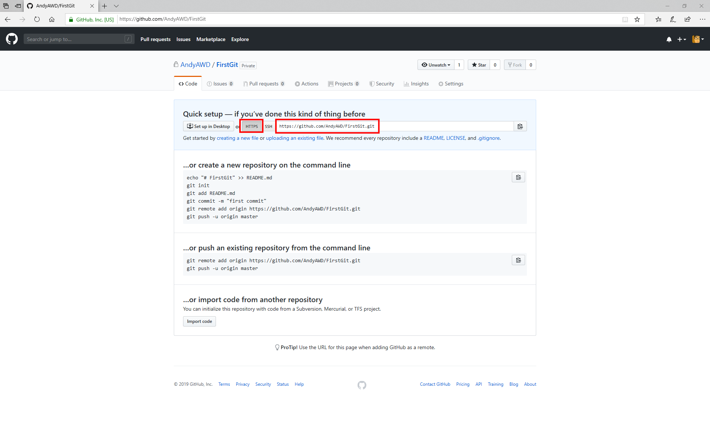
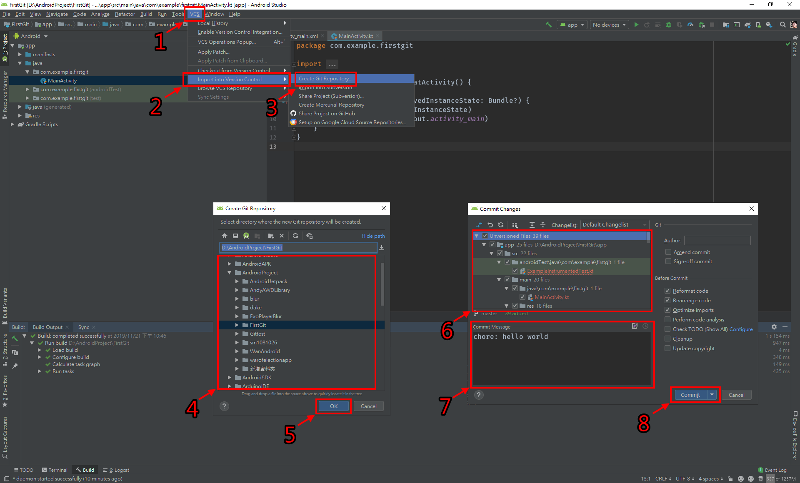

# AndroidStudioVCS

## 曾經我也習慣使用SourceTree，直到...  
* 懶的用滑鼠
* 懶的切畫面
* 看過JetBrains技術傳教士各種風騷操作後，想要多瞭解Android Studio(IntelliJ IDEA)有什麼有趣的功能
* 題外話，聽說大神們都用指令模式，等我學會後再補上
* 如果有錯誤的地方也請指正，謝謝

## 本篇會講
1. 使用Android Studio搭配GitFlow和Angular commit Standard操作Git
2. 使用SourceTree搭配GitFlow和Angular commit Standard操作Git

## 本篇不會講
* 產生SSH金鑰
***

## 上傳新專案
* 這個超級很容易忘記的

### SourceTree教學
* 先從GitHub建立一個空白專案
* 複製專案網址

1. 點擊"Create"移動到建立頁面
2. 點擊"Browse"選擇資料夾
3. 選擇專案資料夾後點擊"選擇資料夾"
4. 點擊Create

5. 點擊"Yes"

6. 選取全部檔案，或者自己選擇要推送的檔案
7. 輸入提交訊息
8. 點擊"Commit"
9. 點擊"Yes"
* 這時候只有推送到本地端，接下來要推送到遠端

10. 點擊"Romote"
11. 點擊"Settings"

12. 點擊"Add"

13. 輸入專案名稱和網址
14. 點擊"OK"

15. 點擊"OK"

16. 點擊"Push"
17. 選取master分支
18. 點擊"Push"

* 切回GitHub頁面網頁重新整理後就會看到專案已經推送到遠端

### Android Studio(IntelliJ IDEA)教學
* 先從GitHub建立一個空白專案
* 複製專案網址

1. 點擊"VCS"
2. 點擊"Import into Version Control"
3. 點擊"Create Git Repository"
4. 選擇專案資料夾
5. 點擊"OK"
* 鍵盤"Ctrl + k"開啟提交頁面
6. 選取全部檔案，或者自己選擇要推送的檔案
* 如果出現警告視窗，可以把右下方的Before Commit選項中的"Perform code analysis"和"Check TODO(Show All)"取消勾選
7. 點擊"Commit"

8. 點擊"Define remote"
9. 輸入專案網址
10. 點擊"OK"
* 鍵盤"Ctrl + Shift + k"開啟推送頁面
11. 點擊"Push"

* 切回GitHub頁面網頁重新整理後就會看到專案已經推送到遠端

