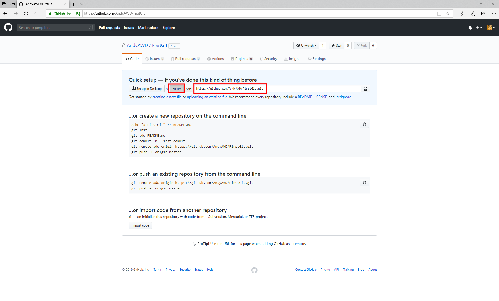
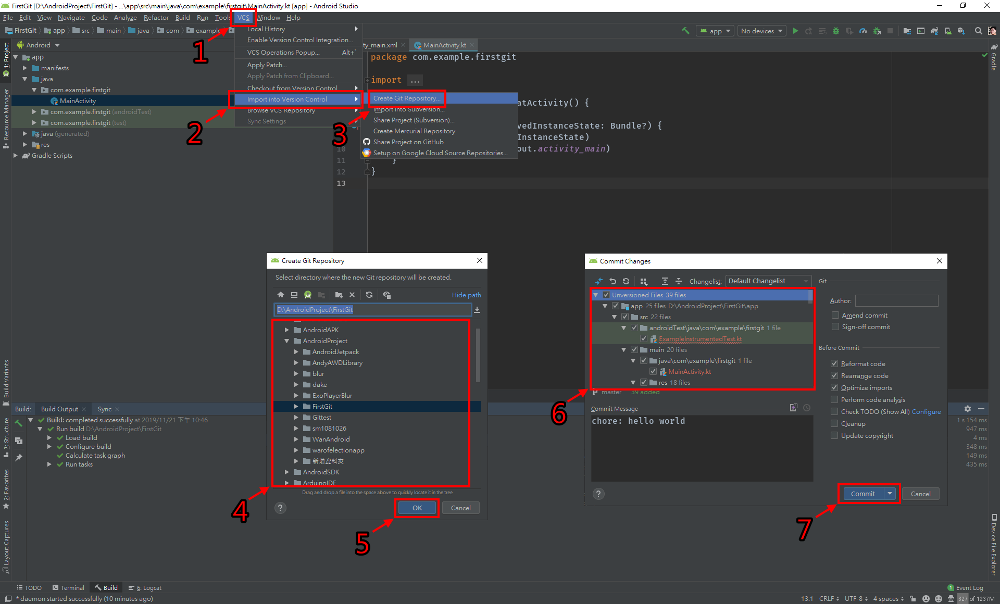
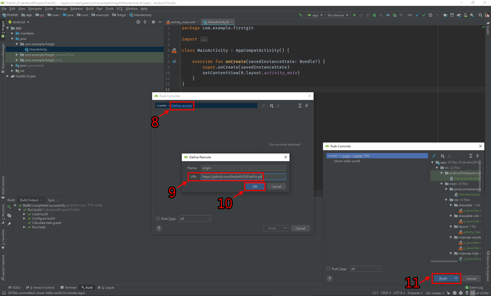
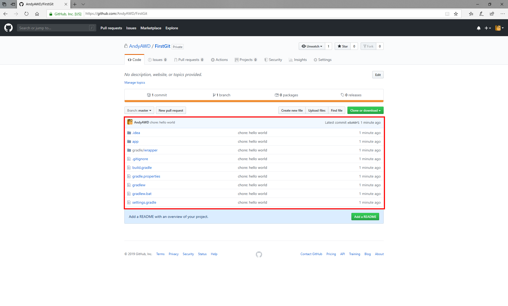

## 建立專案
* 這個超級很容易忘記的

### Android Studio(IntelliJ IDEA)教學
* 先從GitHub建立一個空白專案
* 複製專案網址

1. 點擊"VCS"
2. 點擊"Import into Version Control"
3. 點擊"Create Git Repository"
4. 選擇專案資料夾
5. 點擊"OK"
* 鍵盤"Ctrl + k"開啟提交頁面
6. 選取全部檔案，或者自己選擇要推送的檔案
* 如果出現警告視窗，可以把右下方的Before Commit選項中的"Perform code analysis"和"Check TODO(Show All)"取消勾選
7. 點擊"Commit"

8. 點擊"Define remote"
9. 輸入專案網址
10. 點擊"OK"
* 鍵盤"Ctrl + Shift + k"開啟推送頁面
11. 點擊"Push"

* 切回GitHub頁面網頁重新整理後就會看到專案已經推送到遠端
