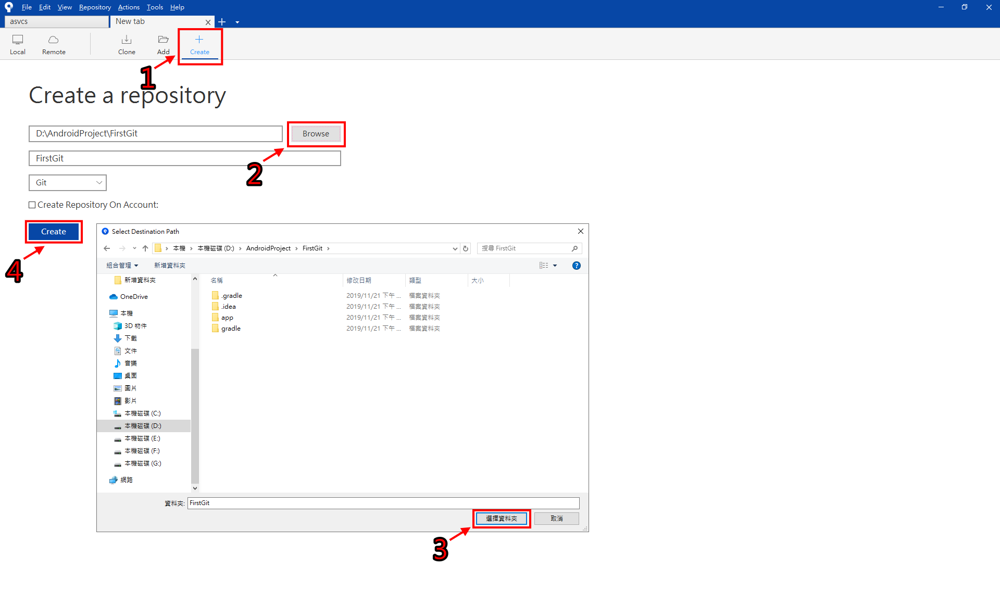
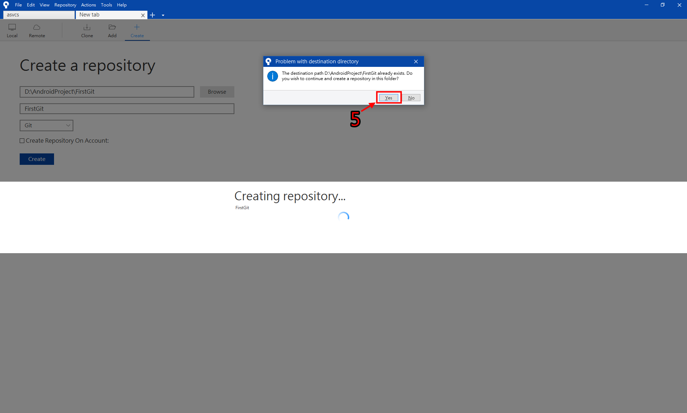
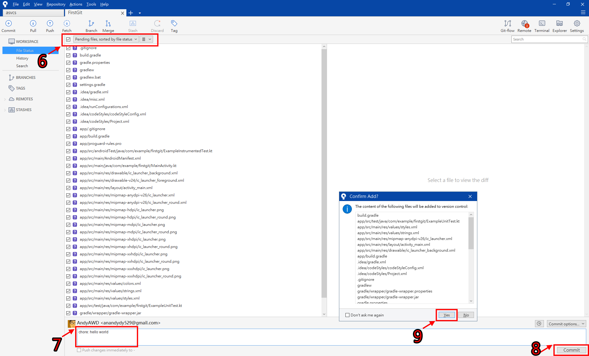
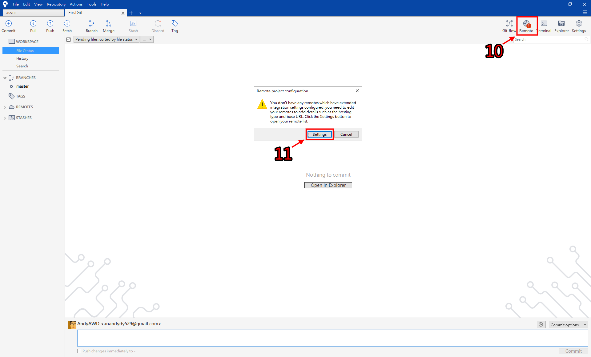
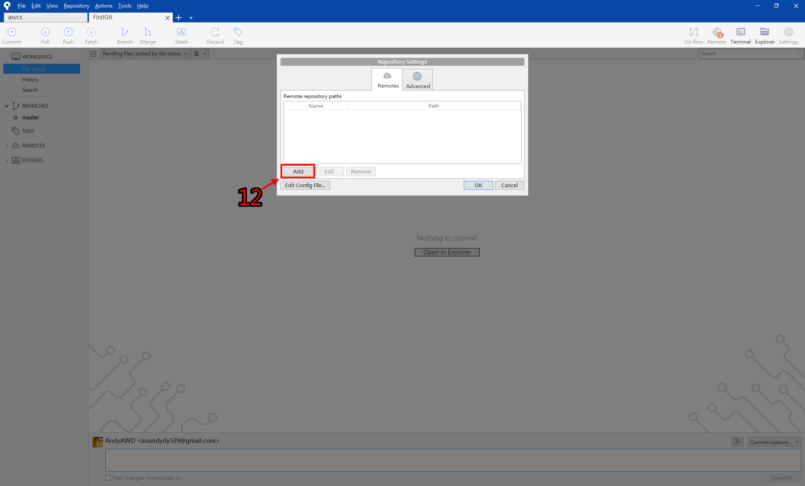

## 建立專案
* 這個超級很容易忘記的

### SourceTree教學
* 先從GitHub建立一個空白專案
* 複製專案網址

1. 點擊"Create"移動到建立頁面
2. 點擊"Browse"選擇資料夾
3. 選擇專案資料夾後點擊"選擇資料夾"
4. 點擊Create

5. 點擊"Yes"

6. 選取全部檔案，或者自己選擇要推送的檔案
7. 輸入提交訊息
8. 點擊"Commit"
9. 點擊"Yes"
* 這時候只有推送到本地端，接下來要推送到遠端

10. 點擊"Romote"
11. 點擊"Settings"

12. 點擊"Add"

13. 輸入專案名稱和網址
14. 點擊"OK"

15. 點擊"OK"

16. 點擊"Push"
17. 選取master分支
18. 點擊"Push"

* 切回GitHub頁面網頁重新整理後就會看到專案已經推送到遠端
